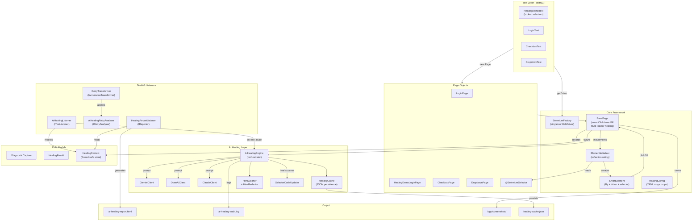
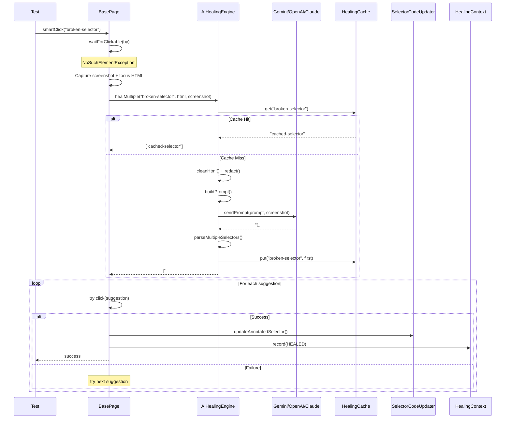

# User Manual - AI Self-Healing Test Automation Framework

> Complete technical reference for test writers, framework maintainers, and anyone presenting or extending this project.

---

## Table of Contents

1. [Architecture Overview](#1-architecture-overview)
2. [System Requirements](#2-system-requirements)
3. [Project Structure](#3-project-structure)
4. [Configuration Reference](#4-configuration-reference)
5. [Core Framework Components](#5-core-framework-components)
6. [AI Self-Healing Engine](#6-ai-self-healing-engine)
7. [TestNG Listeners & Reporting](#7-testng-listeners--reporting)
8. [Test Data Management](#8-test-data-management)
9. [Writing Tests](#9-writing-tests)
10. [Running Tests](#10-running-tests)
11. [Logging & Diagnostics](#11-logging--diagnostics)
12. [Security Considerations](#12-security-considerations)
13. [Extending the Framework](#13-extending-the-framework)
14. [Troubleshooting](#14-troubleshooting)
15. [FAQ - 50 Questions & Answers](#15-faq---50-questions--answers)
16. [Architecture Diagrams](#16-architecture-diagrams)
17. [Presentation Script](#17-presentation-script)

---

## 1. Architecture Overview

The framework implements a **four-layer defense** against selector failures:

```
Layer 1: BasePage Inline Healing
    smartClick() / smartFill() catch NoSuchElementException / TimeoutException
    → Consult AI → Get 5 alternative locators → Try each sequentially
    → On success: update source code + continue test

Layer 2: AiHealingRetryAnalyzer (IRetryAnalyzer)
    If the test still fails → Retry once automatically
    → Cached heals from Layer 1 apply immediately on retry

Layer 3: AiHealingListener (ITestListener.onTestFailure)
    Captures full DiagnosticCapture for any locator failure
    → Records HealingResult for reporting

Layer 4: HealingReportListener (IReporter)
    Generates ai-healing-report.html with full breakdown
    → Prints console summary banner
```

### Design Patterns Used

| Pattern | Where | Purpose |
|---------|-------|---------|
| **Page Object Model** | `pages/` package | Encapsulate UI interactions |
| **Strategy Pattern** | `LLMClient` interface | Swap AI providers without changing core logic |
| **Singleton** | `SeleniumFactory`, `HealingConfig` | Single driver instance, single config |
| **Observer** | TestNG Listeners | React to test lifecycle events |
| **Builder** | `DiagnosticCapture`, `HealingResult` | Construct complex data objects |
| **Template Method** | `BasePage` | Abstract base with concrete healing logic |

---

## 2. System Requirements

| Component | Minimum | Recommended |
|-----------|---------|-------------|
| Java | JDK 17 | JDK 17+ |
| Maven | 3.6 | 3.8+ |
| Browser | Chrome 100+ | Latest Chrome/Edge |
| RAM | 4 GB | 8 GB |
| Network | Internet access | Stable broadband |
| OS | Windows 10, macOS 12, Linux | Any with Java 17 support |

---

## 3. Project Structure

```
Java_selenium_Playwright_Autohealing/
│
├── .env                                    # API keys (NEVER commit)
├── .gitignore                              # Excludes .env, logs, target
├── pom.xml                                 # Maven build + dependencies
├── testng.xml                              # Test suite with listeners
├── healing-cache.json                      # Auto-generated at runtime
│
├── src/main/java/com/automation/
│   │
│   ├── ai/                                 # AI Healing Layer
│   │   ├── AIHealingEngine.java            #   Orchestrator: prompt → LLM → parse → validate
│   │   ├── LLMClient.java                  #   Interface (Strategy pattern)
│   │   ├── GeminiClient.java               #   Google Gemini implementation
│   │   ├── OpenAIClient.java               #   OpenAI GPT implementation
│   │   ├── ClaudeClient.java               #   Anthropic Claude implementation
│   │   ├── HealingCache.java               #   Persistent JSON cache (failedSelector → healedSelector)
│   │   └── HtmlRedactor.java               #   Redacts passwords, tokens, emails from HTML
│   │
│   ├── base/                               # Core Framework
│   │   ├── BasePage.java                   #   smartClick/smartFill + multi-locator healing + CSS capture
│   │   └── SeleniumFactory.java            #   Singleton driver factory (Chrome/Firefox/Edge)
│   │
│   ├── config/                             # Configuration
│   │   └── HealingConfig.java              #   Loads healing-config.yaml + system property overrides
│   │
│   ├── listeners/                          # TestNG Integration
│   │   ├── AiHealingListener.java          #   ITestListener: intercepts failures, captures diagnostics
│   │   ├── AiHealingRetryAnalyzer.java     #   IRetryAnalyzer: auto-retry on locator failures
│   │   ├── RetryTransformer.java           #   IAnnotationTransformer: auto-applies retry to all tests
│   │   ├── HealingReportListener.java      #   IReporter: generates HTML healing report
│   │   └── HealingContext.java             #   Thread-safe store for HealingResult across run
│   │
│   ├── models/                             # Data Models
│   │   ├── User.java                       #   Test data POJO
│   │   ├── DiagnosticCapture.java          #   Full failure snapshot (HTML, screenshot, CSS, URL)
│   │   └── HealingResult.java              #   Healing outcome (HEALED/FAILED/SKIPPED/CACHE_HIT)
│   │
│   ├── pages/                              # Page Objects
│   │   ├── LoginPage.java                  #   Correct selectors for the-internet.herokuapp.com/login
│   │   ├── HealingDemoLoginPage.java       #   BROKEN selectors (AI healing demo)
│   │   ├── CheckboxPage.java               #   /checkboxes page
│   │   ├── DropdownPage.java               #   /dropdown page
│   │   ├── SeleniumSelector.java           #   @SeleniumSelector annotation
│   │   └── ElementInitializer.java         #   Reflection-based field wiring
│   │
│   └── utils/                              # Utilities
│       ├── HtmlCleaner.java                #   DOM simplification (strips noise for AI)
│       ├── JsonUtils.java                  #   JSON → POJO loader
│       ├── SelectorCodeUpdater.java        #   Auto-patches @SeleniumSelector in source files
│       └── SmartElement.java               #   Element wrapper with selector tracking
│
├── src/main/resources/
│   ├── config.properties                   # Browser config
│   ├── healing-config.yaml                 # AI healing config
│   └── log4j2.xml                          # Logging config
│
├── src/test/java/com/automation/tests/
│   ├── HealingDemoTest.java                # Broken selectors → AI heals them live
│   ├── LoginTest.java                      # Valid + invalid login
│   ├── CheckboxTest.java                   # Toggle checkboxes
│   └── DropdownTest.java                   # Select dropdown options
│
└── src/test/resources/data/                # Test Input Data
    ├── user.json
    ├── login/
    │   ├── valid_credentials.json
    │   └── invalid_credentials.json
    ├── forms/
    │   └── contact_form.json
    ├── healing/
    │   └── broken_selectors.json
    └── environments/
        └── staging.json
```

---

## 4. Configuration Reference

### 4.1 Browser Configuration (`config.properties`)

| Key | Options | Default | Description |
|-----|---------|---------|-------------|
| `browser.type` | `chrome`, `chromium`, `firefox`, `edge` | `chrome` | Browser to launch |
| `browser.headless` | `true`, `false` | `false` | Run without visible window |

### 4.2 Healing Configuration (`healing-config.yaml`)

```yaml
healing:
  enabled: true              # Global on/off toggle
  retry.count: 5             # AI suggestions to try (1-5)
  auto.update.code: true     # Auto-patch source files on successful heal
  max.html.chars: 200000     # Max HTML chars sent to AI

ai:
  provider: GEMINI           # GEMINI | OPENAI | CLAUDE
  gemini:
    model: gemini-2.0-flash
  openai:
    model: gpt-4o
  claude:
    model: claude-sonnet-4-20250514

screenshot:
  enabled: true
  directory: logs/screenshots

dom:
  simplified: true           # Strip noise (scripts, styles, SVGs, meta)
  capture.css: true          # Include computed CSS of failed elements
```

### 4.3 System Property Overrides

Every YAML setting can be overridden at runtime:

```bash
mvn test -Dhealing.enabled=false
mvn test -Dhealing.retry.count=3
mvn test -Dhealing.auto.update.code=false
mvn test -Dai.provider=CLAUDE
mvn test -Dhealing.screenshot.enabled=false
mvn test -Dhealing.dom.simplified=false
mvn test -Dhealing.dom.capture.css=false
mvn test -Dhealing.cache.path=custom/path/cache.json
```

### 4.4 API Keys (`.env` file)

```bash
# Gemini (default)
GEMINI_API_KEY=your_key
GEMINI_MODEL=gemini-2.0-flash

# OpenAI
OPENAI_API_KEY=sk-your-key
OPENAI_MODEL=gpt-4o

# Claude
CLAUDE_API_KEY=sk-ant-your-key
CLAUDE_MODEL=claude-sonnet-4-20250514
```

> **Security:** `.env` is in `.gitignore` and is NEVER committed. The framework also redacts passwords, tokens, and emails from HTML before sending to any AI provider.

### 4.5 Configuration Precedence

```
System Property  >  healing-config.yaml  >  Hard-coded Default
     (highest)          (medium)               (lowest)
```

---

## 5. Core Framework Components

### 5.1 `SeleniumFactory` (Driver Lifecycle)

**File:** `src/main/java/com/automation/base/SeleniumFactory.java`

Singleton factory that manages the WebDriver lifecycle:

```java
SeleniumFactory factory = SeleniumFactory.getInstance();
WebDriver driver = factory.getDriver();

// When done:
factory.close();  // Quits browser and resets singleton
```

Key behaviors:
- Reads `config.properties` for browser type and headless mode
- Uses Selenium Manager for automatic driver binary download
- `close()` quits the driver AND resets the singleton (safe to re-create)
- `getDriver()` auto-initializes if driver is null

### 5.2 `BasePage` (Smart Actions + Healing)

**File:** `src/main/java/com/automation/base/BasePage.java`

Abstract base that all Page Objects extend. Provides:

| Method | Description |
|--------|-------------|
| `smartClick(String selector)` | Click with healing on `NoSuchElementException` / `TimeoutException` |
| `smartClick(SmartElement element)` | Click via SmartElement with healing |
| `smartFill(String selector, String value)` | Fill input with healing |
| `smartFill(SmartElement element, String value)` | Fill via SmartElement with healing |
| `navigateTo(String url)` | Navigate to URL |
| `waitForVisible(By by)` | Explicit wait for visibility (10s) |
| `waitForClickable(By by)` | Explicit wait for clickability (10s) |
| `toBy(String selector)` | Convert string to Selenium `By` (CSS or xpath=) |

**Healing flow inside smartClick/smartFill:**

1. Attempt action with original selector
2. Catch `NoSuchElementException`, `TimeoutException`, or `StaleElementReferenceException`
3. If healing is disabled → rethrow immediately
4. Capture focus HTML + computed CSS + screenshot
5. Call `AIHealingEngine.healMultiple()` → get up to 5 suggestions
6. Iterate suggestions: try each with a 3-second validation wait
7. First one that works → use it, record `HealingResult.HEALED`
8. None work → throw `NoSuchElementException`, record `HealingResult.FAILED`
9. Persist healed selector (in-memory + source code if configured)

### 5.3 `SmartElement` (Element Wrapper)

**File:** `src/main/java/com/automation/utils/SmartElement.java`

Wraps a Selenium `By` + `WebDriver` + the original selector string:

| Method | Description |
|--------|-------------|
| `click()` | Routes through `BasePage.smartClick()` for healing |
| `fill(String value)` | Routes through `BasePage.smartFill()` for healing |
| `getText()` | Get element text |
| `isVisible()` | Check visibility (safe, returns false on error) |
| `getElement()` | Raw `driver.findElement(by)` |
| `updateSelector(String)` | Update the in-memory selector after healing |

### 5.4 `@SeleniumSelector` + `ElementInitializer`

Declare elements declaratively in Page Objects:

```java
@SeleniumSelector(value = "input[name='username']")
private SmartElement usernameField;

@SeleniumSelector(value = "xpath=//button[@type='submit']")
private SmartElement submitButton;
```

`ElementInitializer.initElements(driver, this)` is called automatically in the `BasePage` constructor. It uses reflection to find annotated fields, create `SmartElement` instances, and inject them.

### 5.5 Selector Format

| Format | Example | When to Use |
|--------|---------|-------------|
| CSS (default) | `"#username"` | Most cases - shorter, faster |
| CSS attribute | `"input[name='email']"` | When ID is absent |
| XPath | `"xpath=//div[@class='login']//button"` | Complex traversals |
| XPath (auto) | `"//div[@id='main']"` | Strings starting with `//` auto-detect as XPath |

---

## 6. AI Self-Healing Engine

### 6.1 `AIHealingEngine` (Orchestrator)

**File:** `src/main/java/com/automation/ai/AIHealingEngine.java`

Central orchestrator that ties everything together:

```java
// Single selector (backward-compatible)
String healed = engine.heal(failedSelector, pageHtml);

// Multi-locator (new - returns up to 5 suggestions)
List<String> suggestions = engine.healMultiple(
    failedSelector, pageHtml, allowCache, focusHtml, screenshotBase64
);
```

**Internal pipeline:**

```
1. Check config: healing.enabled?
2. Check cache: HealingCache.get(failedSelector)?
3. Clean HTML: HtmlCleaner.cleanHtml() → removes scripts, styles, SVGs, meta
4. Redact HTML: HtmlRedactor.redact() → masks passwords, tokens, emails
5. Build prompt: failedSelector + focus HTML + full page HTML + screenshot reference
6. Call LLM: provider.sendPrompt(prompt, screenshot)
7. Parse response: extract numbered list of selectors
8. Return List<String> of suggestions
```

### 6.2 LLM Providers

All three providers implement the `LLMClient` interface:

```java
public interface LLMClient {
    String sendPrompt(String prompt);
    default String sendPrompt(String prompt, String screenshotBase64Png) {
        return sendPrompt(prompt);
    }
}
```

| Provider | Class | API Endpoint | Multimodal |
|----------|-------|-------------|------------|
| **Gemini** | `GeminiClient` | `generativelanguage.googleapis.com/v1beta` | Yes (vision) |
| **OpenAI** | `OpenAIClient` | `api.openai.com/v1/chat/completions` | Yes (vision) |
| **Claude** | `ClaudeClient` | `api.anthropic.com/v1/messages` | Yes (vision) |

**Provider selection logic:**

1. Check `ai.provider` in `healing-config.yaml` (GEMINI/OPENAI/CLAUDE)
2. If not configured, detect by API key presence: GEMINI → CLAUDE → OPENAI
3. Default: Gemini

### 6.3 Prompt Engineering

The system prompt instructs the AI to return exactly 5 numbered selectors:

```
You are an expert UI test automation assistant.

Return EXACTLY 5 alternative selectors, one per line, numbered 1-5.
Mix of CSS selectors and XPath selectors.
Prefix XPath selectors with: xpath=
Do NOT include markdown, backticks, quotes, explanations, or extra whitespace.

Selector quality rules:
- Prefer stable attributes: data-testid, data-test, aria-label, role, name, placeholder, type, href, for, title.
- Avoid brittle selectors: nth-child, deeply nested chains, dynamic ids/classes.
```

The user prompt includes:
- The failed selector string
- Focus HTML (outerHTML of nearby elements with 2 parent levels)
- Computed CSS styles of the target area
- Full page HTML (cleaned, redacted, capped at 200K chars)
- Screenshot reference (if multimodal)

### 6.4 Response Parsing

The `parseMultipleSelectors()` method handles various response formats:

```
1. #username                    → parsed as CSS
2. input[name='username']       → parsed as CSS
3. xpath=//input[@id='username'] → parsed as XPath
4. [data-testid='user-input']   → parsed as CSS
5. xpath=//form//input[1]       → parsed as XPath
```

It strips numbering (`1.`, `1)`, `1:`), removes surrounding quotes, validates that each line looks like a selector, and caps at `retry.count` entries.

### 6.5 HealingCache

**File:** `src/main/java/com/automation/ai/HealingCache.java`

Persistent JSON cache stored in `healing-cache.json`:

```json
{
  "input[data-qa='user-login-field']": "#username",
  "button.btn-primary-login": "button[type='submit']"
}
```

- Cache is consulted FIRST before calling the AI
- Successful heals are auto-cached
- If cached selector is stale, cache is bypassed and AI is called fresh
- Override path: `-Dhealing.cache.path=custom/cache.json`

### 6.6 HTML Processing

**`HtmlCleaner.cleanHtml(html)`** removes:
- `<script>` tags + content
- `<style>` tags + content
- `<svg>` tags + content
- `<noscript>`, `<meta>`, `<link>` tags
- HTML comments
- Inline event handlers (`onclick`, `onload`, etc.)
- Random data attributes (framework-generated hashes)
- Excessive whitespace

**`HtmlCleaner.toSkeletonDom(html)`** (aggressive mode):
- Strips ALL attributes except: `id`, `class`, `name`, `type`, `role`, `aria-*`, `data-testid`, `data-test`, `href`, `for`, `placeholder`, `title`, `value`, `action`, `method`

**`HtmlRedactor.redact(html)`** masks:
- Password input values → `[REDACTED_PASSWORD]`
- JWT-like tokens → `[REDACTED_TOKEN]`
- Email addresses → `[REDACTED_EMAIL]@domain.com`
- Generic value attributes → `[REDACTED]`

### 6.7 SelectorCodeUpdater (Auto-Patching)

**File:** `src/main/java/com/automation/utils/SelectorCodeUpdater.java`

When `healing.auto.update.code: true` and a heal succeeds for an `@SeleniumSelector` field:

**Before healing:**
```java
    @SeleniumSelector(value = "input[data-qa='user-login-field']")
    private SmartElement usernameField;
```

**After healing:**
```java
    // @SeleniumSelector(value = "input[data-qa='user-login-field']")
    @SeleniumSelector(value = "#username")
    private SmartElement usernameField;
```

- Original line is commented out (never deleted)
- New line added immediately below
- Backup saved to `.selector_backups/` directory
- Only modifies fields that match the expected pattern

---

## 7. TestNG Listeners & Reporting

### 7.1 Listener Registration (`testng.xml`)

```xml
<listeners>
    <listener class-name="com.automation.listeners.AiHealingListener"/>
    <listener class-name="com.automation.listeners.HealingReportListener"/>
    <listener class-name="com.automation.listeners.RetryTransformer"/>
</listeners>
```

### 7.2 `AiHealingListener` (ITestListener)

Intercepts every test failure and checks if it's a locator issue:

**Detected exceptions:**
- `NoSuchElementException`
- `TimeoutException`
- `StaleElementReferenceException`
- `InvalidSelectorException`
- Any exception with messages containing: "no such element", "unable to locate", "element not found", "timeout", "stale element"

**On locator failure:**
1. Extracts WebDriver from the test instance via reflection
2. Extracts the failed selector from the exception message
3. Builds a `DiagnosticCapture` (page source, simplified DOM, screenshot, URL, title)
4. Consults `AIHealingEngine.healMultiple()` for suggestions
5. Validates each suggestion against the live page
6. Records a `HealingResult` in `HealingContext`

### 7.3 `AiHealingRetryAnalyzer` (IRetryAnalyzer)

Allows one automatic retry for locator-based failures:

- Only retries if the failure is a locator issue (same detection as AiHealingListener)
- Maximum 1 retry (the test runs at most twice)
- On retry, cached heals from the first attempt apply immediately
- Respects `healing.enabled` configuration

### 7.4 `RetryTransformer` (IAnnotationTransformer)

Automatically applies `AiHealingRetryAnalyzer` to every `@Test` method. No manual annotation needed on individual tests.

### 7.5 `HealingReportListener` (IReporter)

Generates two outputs after the suite completes:

**Console banner:**
```
╔══════════════════════════════════════════════════════════════╗
║               AI SELF-HEALING REPORT SUMMARY                ║
╠══════════════════════════════════════════════════════════════╣
║  Total Healing Events:    5                                  ║
║  Passed with Healing:     3                                  ║
║  Failed (Healing Tried):  1                                  ║
║  Skipped:                 1                                  ║
╚══════════════════════════════════════════════════════════════╝
```

**HTML report:** `target/surefire-reports/ai-healing-report.html`
- Summary cards (total, healed, failed, skipped)
- Detailed table with: status badge, test class, test method, original selector, healed selector, AI provider, duration, numbered suggestions (winner highlighted)

### 7.6 `HealingContext` (Shared State)

Thread-safe `CopyOnWriteArrayList` that collects `HealingResult` objects across the entire run. Both `BasePage` and `AiHealingListener` write to it; `HealingReportListener` reads from it.

### 7.7 `DiagnosticCapture` (Failure Snapshot)

Captures everything at the moment of failure:

| Field | Description |
|-------|-------------|
| `timestamp` | When the failure occurred |
| `testMethodName` | Fully qualified test name |
| `failedSelector` | The broken selector string |
| `exceptionType` | Exception class name |
| `exceptionMessage` | Full exception message |
| `fullPageHtml` | Complete page source |
| `simplifiedDom` | Cleaned DOM (no scripts/styles) |
| `focusHtml` | outerHTML of nearby elements |
| `computedCssStyles` | CSS properties of the target area |
| `screenshotBase64Png` | Base64 PNG screenshot |
| `screenshotFilePath` | Path to saved screenshot file |
| `pageUrl` | Current page URL |
| `pageTitle` | Current page title |
| `suggestedSelectors` | AI suggestions |
| `healedSelector` | The one that worked |
| `healed` | true/false |

### 7.8 `HealingResult` (Outcome)

| Field | Description |
|-------|-------------|
| `testName` | Test method name |
| `testClass` | Test class name |
| `originalSelector` | What broke |
| `healedSelector` | What worked (null if failed) |
| `suggestedSelectors` | All AI suggestions |
| `winningIndex` | 1-based index of winner (-1 if none) |
| `outcome` | `HEALED`, `FAILED`, `SKIPPED`, `CACHE_HIT` |
| `aiProvider` | `GEMINI`, `OPENAI`, `CLAUDE` |
| `healingDurationMs` | How long healing took |
| `timestamp` | When it happened |
| `codeUpdated` | Whether source was patched |

---

## 8. Test Data Management

### 8.1 Folder Structure

```
src/test/resources/data/
├── user.json                      # Legacy flat user data
├── login/
│   ├── valid_credentials.json     # {"username":"tomsmith","password":"SuperSecretPassword!"}
│   └── invalid_credentials.json   # {"username":"wronguser","password":"WrongPassword123"}
├── forms/
│   └── contact_form.json          # {"name":"John Doe","email":"john@test.com",...}
├── healing/
│   └── broken_selectors.json      # Documents broken vs correct selectors
└── environments/
    └── staging.json               # Base URLs and page paths
```

### 8.2 Loading Test Data

```java
// Load from subfolder
User user = JsonUtils.getTestData("login/valid_credentials.json", User.class);

// Load from root data folder
User user = JsonUtils.getTestData("user.json", User.class);
```

`JsonUtils` checks the file system first (`src/test/resources/data/`), then falls back to classpath loading.

### 8.3 Creating a New Data Model

```java
@Data  // Lombok generates getters, setters, toString, equals, hashCode
public class Product {
    @JsonProperty("name")
    private String name;

    @JsonProperty("price")
    private double price;

    @JsonProperty("category")
    private String category;
}
```

---

## 9. Writing Tests

### 9.1 Standard Test (Correct Selectors)

```java
@Slf4j
public class LoginTest {
    private SeleniumFactory seleniumFactory;
    private LoginPage loginPage;

    @BeforeClass
    public void setUp() {
        seleniumFactory = SeleniumFactory.getInstance();
        loginPage = new LoginPage(seleniumFactory.getDriver());
    }

    @Test(description = "Valid login using JSON test data")
    public void testValidLogin() {
        User user = JsonUtils.getTestData("login/valid_credentials.json", User.class);
        loginPage.navigateTo("https://the-internet.herokuapp.com/login");
        loginPage.enterUsername(user.getUsername());
        loginPage.enterPassword(user.getPassword());
        loginPage.clickLogin();
        Assert.assertTrue(driver.getPageSource().contains("Secure Area"));
    }

    @AfterSuite
    public void tearDown() {
        if (seleniumFactory != null) seleniumFactory.close();
    }
}
```

### 9.2 Healing Demo Test (Broken Selectors)

```java
public class HealingDemoTest {

    @Test(description = "AI heals 3 broken selectors during login")
    public void testLoginWithBrokenSelectors() {
        // HealingDemoLoginPage has intentionally wrong selectors:
        //   input[data-qa='user-login-field']  → should be #username
        //   #pass-field-old                     → should be #password
        //   button.btn-primary-login            → should be button[type='submit']

        loginPage.navigateTo("https://the-internet.herokuapp.com/login");
        loginPage.enterUsername("tomsmith");       // AI heals selector #1
        loginPage.enterPassword("SuperSecretPassword!"); // AI heals selector #2
        loginPage.clickLogin();                    // AI heals selector #3
    }
}
```

### 9.3 Inline Smart Actions (No Page Object)

```java
@Test
public void testDirectSmartActions() {
    loginPage.navigateTo("https://the-internet.herokuapp.com/login");
    loginPage.smartFill("input#broken-id", "tomsmith");       // AI heals this
    loginPage.smartFill("input.wrong-class", "password123");  // AI heals this
    loginPage.smartClick("button#nonexistent");               // AI heals this
}
```

### 9.4 Registering a New Test

Add to `testng.xml`:

```xml
<test name="My New Tests">
    <classes>
        <class name="com.automation.tests.MyNewTest"/>
    </classes>
</test>
```

---

## 10. Running Tests

### 10.1 Run All Tests

```bash
mvn test
```

### 10.2 Run a Specific Test Class

```bash
mvn test -Dtest=HealingDemoTest
```

### 10.3 Run with Specific Configuration

```bash
# Headless Chrome with Gemini
mvn test -Dbrowser.headless=true -Dai.provider=GEMINI

# Disable healing (run as plain Selenium tests)
mvn test -Dhealing.enabled=false

# Use Claude instead of Gemini
mvn test -Dai.provider=CLAUDE

# Limit to 3 suggestions per heal
mvn test -Dhealing.retry.count=3
```

### 10.4 Run Only the Healing Demo

Create a custom testng XML or use:

```bash
mvn test -Dtest=HealingDemoTest
```

### 10.5 CI Pipeline Example

```bash
mvn clean test \
  -Dbrowser.headless=true \
  -Dhealing.enabled=true \
  -Dhealing.auto.update.code=false \
  -Dai.provider=GEMINI
```

---

## 11. Logging & Diagnostics

### 11.1 Log Files

| File | Purpose |
|------|---------|
| `logs/application.log` | All framework activity (INFO level) |
| `logs/ai-healing-audit.log` | Healing-specific audit trail |
| `logs/screenshots/*.png` | Page screenshots at failure time |
| `healing-cache.json` | Persistent selector cache |
| `target/surefire-reports/ai-healing-report.html` | Visual healing report |
| `target/surefire-reports/index.html` | Standard TestNG report |

### 11.2 What Gets Logged During Healing

```
[AI-HEAL] Failed selector: input[data-qa='user-login-field']
[AI-HEAL] Screenshot attached: true
[AI-HEAL] Prompt length: 45230 chars
[AI-HEAL] Prompt preview (first 2000 chars): The selector 'input[data-qa=...'
[AI-HEAL] Suggestion 1: #username
[AI-HEAL] Suggestion 2: input[name='username']
[AI-HEAL] Suggestion 3: input#username
[AI-HEAL] Suggestion 4: xpath=//input[@id='username']
[AI-HEAL] Suggestion 5: xpath=//form[@id='login']//input[1]
[HEAL-MODE] Trying suggestion 1/5: #username
[HEAL-MODE] Suggestion #1 worked: #username
[AI-HEAL] Source code auto-updated for HealingDemoLoginPage#usernameField
```

### 11.3 Log4j2 Configuration

Configured in `src/main/resources/log4j2.xml`:
- Console appender: all logs
- File appender: `logs/application.log` (rolling, 10MB max, 10 files)
- AI Healing appender: `logs/ai-healing-audit.log` (rolling, 10MB max, 10 files)

---

## 12. Security Considerations

| Concern | Mitigation |
|---------|-----------|
| API keys in source control | `.env` is in `.gitignore`; keys never in YAML or Java files |
| Sensitive data in HTML prompts | `HtmlRedactor` masks passwords, tokens, emails before AI call |
| API key in logs | Keys are never logged; only prompt previews (first 2000 chars) |
| Screenshot data | Screenshots are saved locally; base64 is only sent to the configured AI provider |
| Source code modification | Auto-update creates backups in `.selector_backups/`; can be disabled |

---

## 13. Extending the Framework

### 13.1 Add a New AI Provider

Implement `LLMClient`:

```java
public class MyCustomLLM implements LLMClient {
    @Override
    public String sendPrompt(String prompt) {
        // Call your API and return the raw response
    }

    @Override
    public String sendPrompt(String prompt, String screenshotBase64Png) {
        // Multimodal call (optional)
    }
}
```

Register in `AIHealingEngine.defaultClient()` or inject directly:

```java
AIHealingEngine engine = new AIHealingEngine(new MyCustomLLM());
```

### 13.2 Add a New Page Object

1. Create class extending `BasePage`
2. Annotate fields with `@SeleniumSelector`
3. Create business methods
4. Create test class
5. Register in `testng.xml`

### 13.3 Add Parallel Execution

Replace the singleton `SeleniumFactory` with a `ThreadLocal<WebDriver>` pattern for true parallel execution.

### 13.4 Add Custom Assertions

Create assertion utilities that integrate with the healing context for richer reporting.

---

## 14. Troubleshooting

| Symptom | Cause | Fix |
|---------|-------|-----|
| `mvn` not found | Maven not installed or not in PATH | Install Maven, add `bin/` to PATH |
| Browser doesn't open | First run downloading driver | Run `mvn test` again |
| `ClassNotFoundException` | Test class not in `testng.xml` | Add the class to the XML |
| AI healing returns null | API key missing or invalid | Check `.env` and `logs/ai-healing-audit.log` |
| Healing too slow | Large HTML or slow AI response | Reduce `max.html.chars`; use Gemini Flash |
| Source code not updating | `auto.update.code` is false | Set to `true` in `healing-config.yaml` |
| `StaleElementReferenceException` | DOM changed between find and action | Framework auto-retries; increase wait |
| Tests pass locally but fail in CI | Missing headless mode | Set `browser.headless=true` |
| `healing-cache.json` conflicts | Stale cached selectors | Delete the file to start fresh |
| Screenshots not saving | Directory permissions | Check `logs/screenshots/` is writable |

---

## 15. FAQ - 50 Questions & Answers

1. **Q:** What problem does this framework solve?
   **A:** It automates browser testing with Selenium + TestNG and automatically repairs broken selectors using AI, reducing maintenance burden.

2. **Q:** What design patterns are used?
   **A:** Page Object Model, Strategy (LLM providers), Singleton (driver/config), Observer (TestNG listeners), Builder (diagnostic/result models), Template Method (BasePage).

3. **Q:** Which AI providers are supported?
   **A:** Google Gemini, OpenAI GPT, and Anthropic Claude. All three support multimodal (text + screenshot).

4. **Q:** How many alternative selectors does the AI return?
   **A:** Up to 5 (configurable via `retry.count`), mixing CSS and XPath.

5. **Q:** What happens if no AI key is configured?
   **A:** Tests run normally. Healing is skipped; failures propagate as usual.

6. **Q:** What exceptions trigger healing?
   **A:** `NoSuchElementException`, `TimeoutException`, `StaleElementReferenceException`, `InvalidSelectorException`, and any exception with locator-related messages.

7. **Q:** Does healing modify my source code?
   **A:** Yes, if `auto.update.code: true`. It comments the old selector and adds the new one. Backups are created in `.selector_backups/`.

8. **Q:** Can I disable source code modification?
   **A:** Yes. Set `healing.auto.update.code: false` in YAML or `-Dhealing.auto.update.code=false`.

9. **Q:** What is the healing cache?
   **A:** A JSON file (`healing-cache.json`) that remembers successful heals. On future runs, cached mappings are used instantly without calling the AI.

10. **Q:** How do I clear the healing cache?
    **A:** Delete `healing-cache.json` from the project root.

11. **Q:** Is sensitive data protected?
    **A:** Yes. `HtmlRedactor` masks passwords, JWT tokens, and emails before sending HTML to the AI.

12. **Q:** Are screenshots sent to the AI?
    **A:** Yes, if the provider supports vision (all three do). Screenshots help the AI visually identify the intended element.

13. **Q:** Where are screenshots saved?
    **A:** `logs/screenshots/` with timestamped filenames.

14. **Q:** What is the healing report?
    **A:** An HTML file (`target/surefire-reports/ai-healing-report.html`) showing which tests were healed, what selectors were fixed, and which AI suggestions worked.

15. **Q:** What does "Passed with Healing" mean?
    **A:** The test had a broken selector, the AI fixed it at runtime, and the test completed successfully.

16. **Q:** How do TestNG listeners work here?
    **A:** Three listeners auto-register via `testng.xml`: `AiHealingListener` (captures failures), `HealingReportListener` (generates report), `RetryTransformer` (auto-applies retry to all tests).

17. **Q:** What is the RetryAnalyzer?
    **A:** It allows one automatic retry for locator failures, so cached heals from the first attempt apply on the second try.

18. **Q:** What browsers are supported?
    **A:** Chrome/Chromium, Firefox, and Edge.

19. **Q:** How do I switch browsers?
    **A:** Change `browser.type` in `config.properties`.

20. **Q:** What is headless mode?
    **A:** The browser runs without a visible window. Set `browser.headless=true`.

21. **Q:** How are selectors specified?
    **A:** CSS by default (`"#username"`). XPath with prefix (`"xpath=//input[@id='user']"`). Strings starting with `//` auto-detect as XPath.

22. **Q:** What is `SmartElement`?
    **A:** A wrapper around Selenium `By` that routes actions through `BasePage.smartClick/smartFill` for healing.

23. **Q:** What is `ElementInitializer`?
    **A:** Uses reflection to auto-wire `@SeleniumSelector` fields to `SmartElement` instances.

24. **Q:** Why use explicit waits instead of implicit waits?
    **A:** Implicit waits (`0` here) are unpredictable. Explicit waits (`WebDriverWait`) are controlled and debuggable.

25. **Q:** What is the default wait timeout?
    **A:** 10 seconds for normal actions; 3 seconds for healing validation.

26. **Q:** What is `HealingConfig`?
    **A:** A singleton that loads `healing-config.yaml`, applies system property overrides, and provides typed getters for all settings.

27. **Q:** Can I override config at runtime?
    **A:** Yes. System properties override YAML: `-Dhealing.enabled=false`.

28. **Q:** What is `DiagnosticCapture`?
    **A:** A data class capturing everything at failure time: HTML, screenshot, CSS, URL, title, exception details.

29. **Q:** What is `HealingResult`?
    **A:** The outcome of a healing attempt: original selector, healed selector, all suggestions, outcome enum, timing, provider.

30. **Q:** What does `HtmlCleaner` do?
    **A:** Strips noise from HTML (scripts, styles, SVGs, meta tags, comments, event handlers) so the AI gets a clean DOM.

31. **Q:** What is `toSkeletonDom()`?
    **A:** An aggressive mode that keeps only whitelisted attributes (id, class, name, type, role, aria-*, data-testid, href, etc.).

32. **Q:** How does the framework extract the failed selector from an exception?
    **A:** Parses the exception message for patterns like `"selector":"..."` and `By.cssSelector: ...`.

33. **Q:** How does the listener extract the WebDriver?
    **A:** Uses reflection to find a `WebDriver` field or a `SeleniumFactory` field in the test instance.

34. **Q:** Can I use this without TestNG?
    **A:** The core healing (BasePage + AIHealingEngine) works independently. Listeners and reporting require TestNG.

35. **Q:** How do I add test data?
    **A:** Create a JSON file in `src/test/resources/data/`, create a matching POJO, and load with `JsonUtils.getTestData()`.

36. **Q:** Where do Page Objects go?
    **A:** `src/main/java/com/automation/pages/`.

37. **Q:** Where do tests go?
    **A:** `src/test/java/com/automation/tests/`.

38. **Q:** How do I register a new test?
    **A:** Add it to `testng.xml` under a `<test>` block.

39. **Q:** Is this CI-friendly?
    **A:** Yes. Use `browser.headless=true` and run via `mvn test`.

40. **Q:** Can tests run in parallel?
    **A:** TestNG supports it, but the current singleton driver isn't thread-safe. For parallel, use ThreadLocal drivers.

41. **Q:** What is the `broken_selectors.json` file?
    **A:** Documentation that maps each broken selector in `HealingDemoLoginPage` to its correct counterpart.

42. **Q:** What is `staging.json`?
    **A:** Environment configuration with base URLs and page paths for the test site.

43. **Q:** How do I point tests at a different environment?
    **A:** Load a different environment JSON file and use its `baseUrl` in `navigateTo()`.

44. **Q:** What is the cost of AI healing?
    **A:** Each healing call uses one LLM API request. Gemini Flash is the cheapest option. Caching reduces repeated calls.

45. **Q:** How fast is healing?
    **A:** Typically 2-8 seconds per heal depending on the provider and HTML size.

46. **Q:** What if the website is completely redesigned?
    **A:** AI healing works best for small/moderate changes. A complete redesign may need manual selector updates.

47. **Q:** Can I use this for non-login pages?
    **A:** Absolutely. Create any Page Object, annotate elements, and healing works everywhere `BasePage` is used.

48. **Q:** What is the `.selector_backups` folder?
    **A:** Contains timestamped backups of Page Object files before the auto-updater modifies them.

49. **Q:** How do I disable healing for a specific test?
    **A:** Use raw Selenium `driver.findElement()` instead of `smartClick/smartFill`. Healing only triggers through smart actions.

50. **Q:** In one sentence, what makes this framework special?
    **A:** It's a full Selenium + TestNG framework that autonomously repairs broken selectors at runtime using AI, with multi-provider support, visual reporting, and automatic source code patching.

---

## 16. Architecture Diagrams

### Overall Architecture



### Healing Flow (Step by Step)



---

## 17. Presentation Script

### 2-Minute Script (Ready to Speak)

"Hello everyone. I'm presenting an AI-powered self-healing test automation framework built with Java 17, Selenium, and TestNG.

**The problem:** In test automation, selectors break constantly when the UI changes -- a renamed ID, a moved button, a new CSS class. Each broken selector means a failed build and manual repair.

**The solution:** This framework intercepts selector failures at runtime and consults an AI -- Google Gemini, OpenAI, or Anthropic Claude -- to find replacement selectors automatically.

**How it works:** When a `smartClick` or `smartFill` encounters a `NoSuchElementException`, the framework captures the page HTML and a screenshot, sends them to the configured AI provider, and receives back five alternative locators -- a mix of CSS and XPath. It then validates each one sequentially against the live page. The first working selector is used to continue the test, and the framework auto-updates the source code file so the fix persists.

**Architecture:** The framework uses the Page Object Model with annotation-based element wiring. A `BasePage` provides the smart actions and healing. Three TestNG listeners handle failure interception, automatic retry, and report generation. A dedicated HTML report shows which tests had broken selectors, what the AI suggested, and which suggestion worked.

**Key features:** Three AI providers with multimodal vision support, a persistent healing cache that eliminates repeated API calls, HTML redaction for sensitive data, simplified DOM processing to stay within token limits, and computed CSS capture for better element identification.

**In the demo**, the `HealingDemoTest` uses a Page Object with three intentionally broken selectors. All three are healed by Gemini in real time, and the test passes. The healing report shows every suggestion that was tried and which one won.

This framework turns flaky, high-maintenance test suites into self-repairing ones -- keeping builds green while you fix the root cause at your own pace. Thank you."
